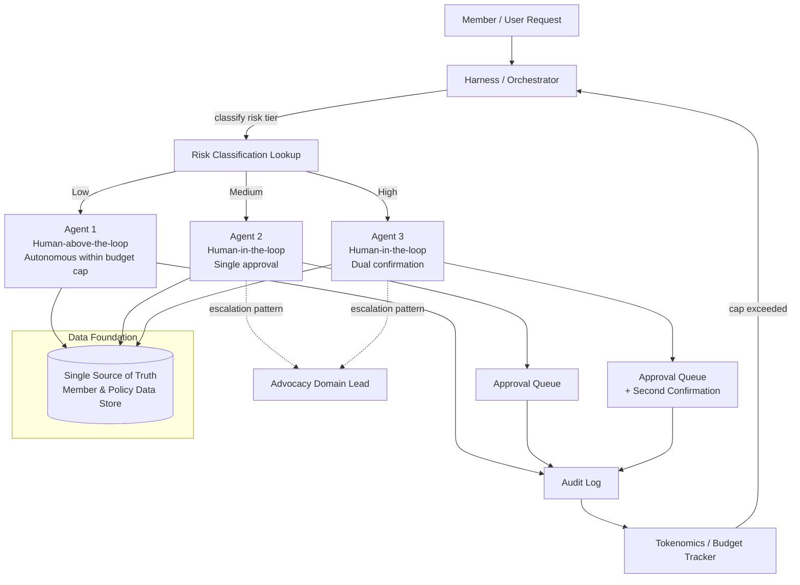

# Architecture Overview

## Notes

- The harness is the only component with routing authority. Agents never self-select their risk tier.
- The escalation path (dotted lines) is deliberately explicit rather than an informal handoff: repeated Medium/High-tier AdviceLine queries on the same theme escalate to Advocacy as a *pattern*, not as individual cases.
- All three agents read from one data store. No agent maintains a local or cached copy of member/policy data (see Governance Principle C, Data Minimalism and Single Source of Truth).
- SSO and the external site sit in front of the harness, not embedded inside it — see `/site`.

This diagram is intentionally rough at this stage (Friday, Deep Block 3). It will be refined once the harness is actually built (Saturday) to confirm it matches the real implementation rather than the plan.
