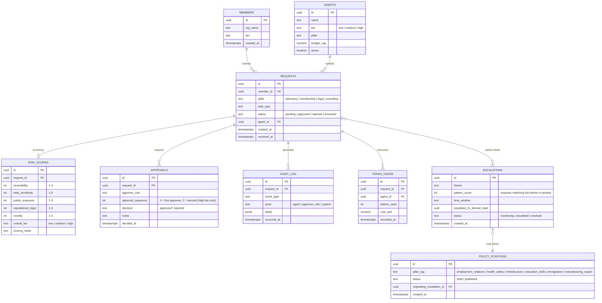

# Data Model — Single Source of Truth

*Applies Governance Principle C: an agent should draw from one authoritative source for any given fact, never a locally cached or reconstructed copy. See `/docs/governance-framework.md`.*

## Design intent

Every table here exists to serve a governance mechanism already defined elsewhere in this repo, not the other way around. The schema follows the mechanisms, not a generic "agent framework" template:

- **Risk-tiered routing** needs `requests` to carry the five scoring dimensions and the resulting tier.
- **Approval chains** need `approvals`, distinct from the request itself, because a High-tier request requires two independent approval records, not one.
- **Audit trail** needs `audit_log` as an append-only table, separate from everything else, so it can never be edited by anything other than an insert.
- **Tokenomics (real-time)** needs `token_usage` as its own table so a live dashboard can query it directly without touching request or approval data.
- **The AdviceLine → Advocacy escalation pattern** needs `escalations`, because a pattern across multiple requests is a distinct entity, not a property of any single request.

## Entity-relationship diagram

## Why this shape, not a simpler one

**`RISK_SCORES` is a separate table from `REQUESTS`, not columns bolted onto it.** This mirrors the actual scoring worksheet: five independent dimensions plus a derived tier, kept together as one unit that can be queried, audited, and revised (as happened live in the scoring session, several scores were corrected with reasoning captured) without touching the request record itself.

**`APPROVALS` allows multiple rows per request deliberately.** A Low-tier request has zero rows here (aggregate review only, per the oversight model). A Medium-tier request has one. A High-tier request has two, `approval_sequence` 1 and 2, enforcing the dual-confirmation rule at the data layer, not just in application logic.

**`AUDIT_LOG` is append-only by convention** (enforced at the application layer, or with a database trigger if built out further): no update or delete path should ever be built against it. This is what makes "Verifiable Trust" (Governance Principle B) actually verifiable rather than asserted.

**`ESCALATIONS` and `POLICY_POSITIONS` exist because the AdviceLine-to-Advocacy pattern is a first-class part of this system, not an afterthought.** A single AdviceLine request never creates a `POLICY_POSITIONS` row on its own. Only a pattern, tracked in `ESCALATIONS`, crossing whatever threshold gets defined, can feed into one. This is the data-layer expression of "AdviceLine escalates the pattern, not the individual case."

## What's deliberately not in scope for this build

- No `MEMBER_PII` detail table (contact info, financial records) — the demo doesn't need real member data to prove the governance pattern, and inventing realistic-looking PII for a public repo is the wrong trade-off even for fictitious data.
- No historical versioning table for `POLICY_POSITIONS` — a real implementation would need this, the demo doesn't.
